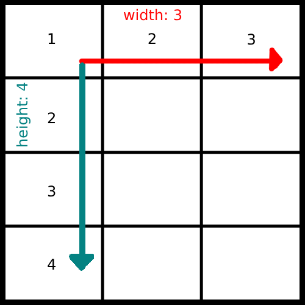

# 🖼️ OpenCV-Frame-Stacker

The OpenCV-Frame-Stacker is a Python library that allows you to stack multiple images or frames using the Numpy library. It provides a convenient way to arrange and combine images into a single canvas. 📸

## :sparkles: Features

- **Stack grayscale images and colorful images**: 
The `stackFrames` function supports stacking both grayscale and colorful images. You can mix grayscale images with images that have multiple channels.
-   Stack multiple images or frames into a single canvas.
-   Customizable stack shape and data type.

### :computer: Tested Platforms

-   Linux (Tested ✔️)
-   Windows (Tested ✔️)
-   MacOS (Not Tested ❌)

## :link: Dependencies

To run this project, you need to have the following dependencies installed:

-   🐍 [Python](https://www.python.org/downloads/): Python is a programming language used by this project.
-   📦 [pip](https://pip.pypa.io/en/stable/): pip is the package installer for Python.
-   🖼️ [OpenCV](https://opencv.org/): OpenCV is a computer vision library used for image processing and manipulation.
-   🧮 [Numpy](https://numpy.org/): Numpy is a library for numerical computing in Python.

Please make sure to install these dependencies before running the project.

## :inbox_tray: Installation

1. Ensure you have Python installed (version 3.6 or higher).
2. Install the required dependencies:

##### Linux

```shell
pip3 install numpy opencv-python
```

##### Widnows

```shell
pip install numpy opencv-python
```

## :hammer_and_wrench: Usage

If you want to download the code and use it in your project, you have two options:

**Option 1**: Copy the code from **[main.py](./main.py)**:

-   Go to the repository where the code is located.
-   Open the **[main.py](./main.py)** file.
-   Select all the code in the file and copy it.
-   Paste the copied code into your own project file.

**Option 2**: Clone the repository:

-   Open your terminal or command prompt.
-   Navigate to the directory where you want to clone the repository.
-   Run the following command to clone the repository:

```shell
git clone <repository-url>
```

Replace <repository-url> with the URL of the repository.
Copy the code from **[main.py](./main.py)** and use it in your project.


## :page_with_curl: Examples

### Stacking Numpy Images

To stack numpy images or frames using the `stackFrames` function, make sure that all frames have an equal number of channels. This is important to ensure proper alignment and concatenation of the frames.

```python
import cv2
import numpy as np


# Load the images or frames
image1 = cv2.imread("path/to/image1.png")
image2 = cv2.imread("path/to/image2.png")
image3 = cv2.imread("path/to/image3.png")

# Stack the frames
result = stackFrames(stack_shape=(2, 2), dtype=np.uint8, frames=[image1, image2, image3])

# Display or save the stacked image
cv2.imshow("Stacked Image", result)
cv2.waitKey(0)
cv2.destroyAllWindows()
```


## :page_with_curl: Examples

The general Stack (e.g., shape = (3,4) ) looks like:



---

**Example 1**: _Stack shape_ = (3,1), _Images_ = 3 (COLORFUL)

```shell
stackFrames(stack_shape=(3, 1), frames=[image_1, image_2, image_3], dtype=np.uint8 )
```


---

**Example 2**: _Stack shape_ = (3,2), _Images_ = 6 (COLORFUL)

```shell
stackFrames(stack_shape=(3, 2), frames=[image_1, image_2, image_3, image_4, image_5, image_6], dtype=np.uint8 )
```


---

**Example 3**: _Stack shape_ = (5,2), _Images_ = 4 (COLORFUL)

```shell
stackFrames(stack_shape=(5, 2), frames=[image_1, image_2, image_3, image_4], dtype=np.uint8 )
```


---

**Example 4**: _Stack shape_ = (2,3), _Images_ = 3 (GRAYSCALE)

```shell
stackFrames(stack_shape=(2, 3), frames=[image_1, image_2, image_3], dtype=np.uint8 )
```


---

**Example 5**: _Stack shape_ = (3, 4), _Images_ = 5 (Both GRAYSCALE and COLORFUL)

```shell
stackFrames(stack_shape=(3, 4), frames=[image_1, image_2, image_3, image_4, image_5], dtype=np.uint8 )
```


---

**Example 6**: _Stack shape_ = (2, 2), _Images_ = 5 **ERROR** :stop_sign:

```shell
stackFrames(stack_shape=(2, 2), frames=[image_1, image_2, image_3, image_4, image_5], dtype=np.uint8 )
```

Outputs **error** :stop_sign::
```shell
    raise ValueError(
ValueError: 
The number of frames is too large for the current stack. Max number of frames for the stack (2, 2) is 4, got: 5
```

## :page_with_curl: Code Description

The `stackFrames` function is used to stack multiple images into a single composite image based on a specified stack shape. The function supports both grayscale and colorful images, allowing you to stack images with different channel dimensions.

#### Function Parameters

- `stack_shape` (tuple): A tuple specifying the desired shape of the image stack in terms of the number of rows and columns.
- `dtype`: The data type of the output image. It determines the range and precision of pixel values.
- `frames` (list | np.ndarray): A list of numpy arrays or a numpy array containing the input images to be stacked. Each element in the list or array represents an image.

#### Function Workflow

1. The function begins by checking if all elements in the `frames` list are of type `np.ndarray`. If any element is not a numpy array, a `ValueError` is raised.
2. Next, the function checks if all the images in the `frames` list are grayscale or colorful.
   - If all images are grayscale, a canvas is created with dimensions based on the specified stack shape.
   - If all images are colorful, a canvas with the same number of channels as the first image in the list is created.
   - If the images are a mix of grayscale and colorful, an equalization process is performed to ensure consistent channel dimensions.
3. The canvas is initialized as an array of zeros with the appropriate dimensions and data type.
4. The function then loops through the stack shape and places each image in the corresponding position on the canvas.
5. Finally, the function returns the composite image.

## :raising_hand: Contributing

🙌 Contributions to this project are welcome! If you have any ideas, improvements, or bug fixes, please submit a pull request 🛠️. For major changes, please open an issue to discuss your ideas beforehand 💡.

## :scroll: License

This project is licensed under the MIT License 📜.

## :pray: Acknowledgments

We would like to express our gratitude to the following projects for their contributions and inspiration:

- [OpenCV](https://opencv.org/): The OpenCV library for providing powerful computer vision and image processing capabilities that form the foundation of this project. 🌟

- [NumPy](https://numpy.org/): The NumPy library for providing efficient array manipulation and mathematical operations, which greatly enhances the functionality of the image stacking process. 🌟


Their dedication and efforts in developing these open-source projects have greatly benefited the development community.
